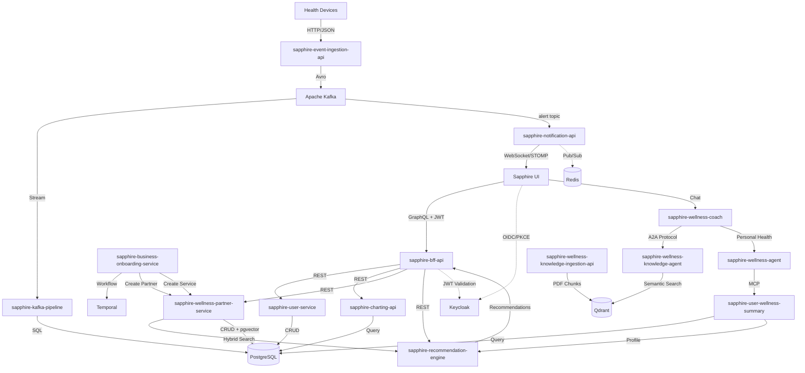

# Sapphire Workspace — System Context

This file describes the system landscape of the Sapphire workspace.
For governing principles, code quality standards, testing requirements, UX rules, and performance budgets, see `.specify/runtime/effective-constitution.md`.

---

## Repositories

| Repo | Role | Language/Framework |
|---|---|---|
| **Sapphire** | React frontend with Keycloak OIDC auth, Apollo GraphQL client, health dashboard UI | TypeScript/React/Vite |
| **sapphire-bff-api** | GraphQL BFF aggregating backend REST APIs, Keycloak JWT validation, WebSocket subscriptions | Node.js/Express/Apollo Server |
| **sapphire-user-service** | User management, subscriptions, wellness summaries with PostgreSQL | Java 17/Spring Boot |
| **sapphire-wellness-partner-service** | B2B partner/service onboarding with pgvector embeddings, entitlements, JSONB metadata | Java 17/Spring Boot/PostgreSQL |
| **sapphire-recommendation-engine** | Stateless hybrid recommendation scoring (keyword + semantic + rule-based) | Java 17/Spring Boot |
| **sapphire-notification-api** | Real-time WebSocket notifications from Kafka with Spring STOMP, user-specific routing | Java 17/Spring Boot/Kafka |
| **sapphire-charting-api** | Health metrics charting and visualization service | Java 17/Spring Boot |
| **sapphire-event-ingestion-api** | High-throughput health telemetry ingestion with Avro schemas, Kafka producer, OTLP tracing | Python/FastAPI/Kafka |
| **sapphire-kafka-pipeline** | Kafka Connect sink connectors streaming health metrics to PostgreSQL timeseries tables | Kafka Connect/PostgreSQL |
| **sapphire-user-wellness-summary** | Generates two-line wellness summaries (rule-based or AI-based) from PostgreSQL telemetry | Python/FastAPI/Ollama |
| **sapphire-wellness-coach** | Conversational AI coach with intelligent routing to knowledge agent via A2A protocol | Python/LangGraph/Ollama/FastAPI |
| **sapphire-wellness-knowledge-agent** | A2A-compliant agent with PDF ingestion, Qdrant semantic search, spaCy tagging | Python/A2A Protocol/FastAPI/Qdrant |
| **sapphire-business-onboarding-service** | Temporal workflow orchestration for partner/service onboarding with signal-based approvals | Java 17/Spring Boot/Temporal |
| **sapphire-playwright** | E2E test scenarios for user journeys (premium, subscriptions, upgrades) | TypeScript/Playwright |
| **sapphire-k6** | K6 load testing with file writer server for capturing request JSONs | K6/JavaScript/Node.js |
| **sapphire-k6-bootstrap** | K6 bootstrap data generator for 7 days of health metrics with Keycloak auth | K6/JavaScript/Node.js |
| **sapphire-fitconnect-agents-deep-eval** | DeepEval framework for agent evaluation (relevancy, faithfulness, hallucination, MCP tools) | Python/DeepEval/OpenAI |
| **sapphire-partner-service-search** | Hybrid (Semantic + BM25) search for partner services | Java 17/Spring Boot |
| **recommendation-workflow-service** | Temporal workflow to generate recommendations | Java 17/Spring Boot |
| **sapphire-wellness-mcp** | MCP service providing tools to get a user's telemetry | FastMCP/Python |
| **sapphire-user-mcp** | MCP service providing tools to get a user's profile, alerts, recommendations | FastMCP/Python |
| **sapphire-embedding-service** | Stateless, generic embedding service generating vector embeddings via Ollama | Java 17/Spring Boot/Ollama |
| **sapphire-kafka-streams-consumer** | Kafka stateful streaming, generating near real-time alerts and saving to Kafka Topic | Java 17/Spring Boot/Kafka Streams |

---

## Repos by Component

| Component | Service Name | Service Description | Repo |
|---|---|---|---|
| Sapphire Web UI | Sapphire Web UI | Web user interface for the Sapphire FitConnect product | Sapphire |
| Authentication Provider | Sapphire Keycloak Realm | Keycloak realm supporting client registration, OIDC and OAuth2 flows | — |
| Sapphire BFF | Sapphire BFF | GraphQL BFF between Web UI and backend services — schema, resolvers (Query, Mutation, Subscription) | sapphire-bff-api |
| Sapphire Health Telemetry Ingestion, Analysis & Alerting | Telemetry Ingestion API | REST API loading telemetry into Kafka | sapphire-event-ingestion-api |
| | Telemetry Ingestion Long Term | Kafka Connect pipeline (Kafka source → PostgreSQL/TimescaleDB sink) | sapphire-kafka-pipeline |
| | Telemetry Analysis Service | REST API for telemetry chart production with timeseries capabilities | sapphire-charting-api |
| | Telemetry Alerting Generation Service | Kafka stateful streaming generating near real-time alerts | sapphire-kafka-streams-consumer |
| | Telemetry Alert Delivery Service | Kafka consumer → Redis Pub/Sub → WebSocket API; persists alerts to User Management | sapphire-notification-api |
| | Health and Wellness Telemetry MCP Service | MCP service providing tools to get a user's telemetry | sapphire-wellness-mcp |
| User Management | User Profile Service | CRUD REST API backed by PostgreSQL for user profiles, alerts, recommendations, and service plans | sapphire-user-service |
| | Wellness Profile Builder Service | CRUD REST API that analyses user telemetry and demography to generate a succinct profile description | sapphire-user-wellness-summary |
| | User Profile MCP Service | MCP service providing tools to get a user's profile, alerts, recommendations | sapphire-user-mcp |
| Wellness Partner & Service Management | Wellness Partner & Service | REST API backed by PostgreSQL for wellness partner CRUD | sapphire-wellness-partner-service |
| | Wellness Plan Search Service | Hybrid search endpoint supporting BM25 and semantic search via pg_textsearch and pgvector | sapphire-partner-service-search |
| | Wellness Partner & Service On-boarding Service | REST API encapsulating a Temporal workflow for long-running approvals and state changes | sapphire-business-onboarding-service |
| Recommendation Management | Recommendation Engine | Stateless REST API generating partner-service recommendations from user profile + hybrid search | sapphire-recommendation-engine |
| | Recommendation Workflow Service | REST API using Temporal to orchestrate a multi-step recommendation pipeline | recommendation-workflow-service |
| Sapphire Wellness Buddy | Wellness Coach Agent | Agentic AI application routing to Wellness Knowledge Agent via A2A and using MCP tools | sapphire-wellness-coach |
| | Wellness Knowledge Agent | Agentic RAG application exposing a retrieval pipeline as an A2A server with LangGraph and Qdrant | sapphire-wellness-knowledge-agent |
| Sapphire Technical Services | Document Embedding Service | Generic REST API for content embedding | sapphire-embedding-service |
| | Data Bootstrap Service | K6 scripts creating health metrics and service bootstrap data | sapphire-k6-bootstrap |
| | Sapphire Kafka Pipeline | Kafka Connect configuration for PostgreSQL sink connector | sapphire-kafka-pipeline |

---

## Task Routing

| Request Type | Primary Repo | Common Secondary Repos |
|---|---|---|
| UI pages, dashboard UX, OIDC client behavior | `Sapphire` | `sapphire-bff-api`, `sapphire-playwright` |
| GraphQL schema/resolvers/aggregation | `sapphire-bff-api` | `Sapphire`, backend service repo being aggregated |
| User profile/subscription domain | `sapphire-user-service` | `sapphire-bff-api`, `Sapphire` |
| Partner/service catalog and entitlements | `sapphire-wellness-partner-service` | `sapphire-recommendation-engine`, `sapphire-bff-api` |
| Recommendation ranking logic | `sapphire-recommendation-engine` | `sapphire-user-wellness-summary`, `sapphire-wellness-partner-service`, `sapphire-bff-api` |
| Real-time alerts and websocket delivery | `sapphire-notification-api` | `sapphire-bff-api`, `Sapphire`, `sapphire-kafka-pipeline` |
| Health metrics chart generation | `sapphire-charting-api` | `sapphire-bff-api`, `Sapphire` |
| Telemetry ingestion and Kafka publish | `sapphire-event-ingestion-api` | `sapphire-kafka-pipeline` |
| Kafka sinks/connectors and stream-to-Postgres | `sapphire-kafka-pipeline` | `sapphire-event-ingestion-api`, consuming services |
| AI coach orchestration/routing | `sapphire-wellness-coach` | `sapphire-wellness-knowledge-agent`, `Sapphire` |
| Knowledge retrieval and vector search | `sapphire-wellness-knowledge-agent` | `sapphire-wellness-knowledge-ingestion-api` |
| Knowledge ingestion/chunking/embeddings | `sapphire-wellness-knowledge-ingestion-api` | `sapphire-wellness-knowledge-agent` |
| Partner onboarding workflows/approvals | `sapphire-business-onboarding-service` | `sapphire-wellness-partner-service` |
| E2E user journeys | `sapphire-playwright` | `Sapphire`, `sapphire-bff-api` |
| Load and bootstrap testing | `sapphire-k6`, `sapphire-k6-bootstrap` | Target service repo |

---

## Cross-Repo Data Flows

### Cross-Repo Workflows

1. **User Dashboard**: UI → BFF (GraphQL) → Backend Services (REST) → PostgreSQL
2. **Device Telemetry**: Devices → Ingestion API → Kafka → Kafka Connect → PostgreSQL
3. **Real-time Alerts**: Kafka → Notification API → WebSocket → UI
4. **AI Coaching**: UI → Wellness Coach → Knowledge Agent (A2A) / Wellness Agent (MCP)
5. **Recommendations**: Summary API → Recommendation Engine ← Partner Service (pgvector)
6. **Partner Onboarding**: Onboarding Service → Temporal Workflows → Partner Service
7. **Knowledge Base**: PDF Ingestion → Qdrant → Knowledge Agent (Semantic Search)

---

## Tech Stack & Architecture Rules

### Architectural Patterns

- **Frontend**: React/Vite, Apollo Client, Keycloak OIDC/PKCE, URL state as source of truth for filters
- **BFF**: Apollo Server, GraphQL schema-first, DataLoader for batching, JWT validation on every resolver
- **Java services**: Spring Boot 3.x, constructor injection, Controller → Service → Repository layering, no business logic in controllers
- **Python services**: FastAPI, async handlers, Pydantic models for validation
- **Messaging**: Kafka for telemetry and alert events, Avro schemas for telemetry, STOMP/WebSocket for delivery
- **AI/Agents**: LangGraph for orchestration, A2A protocol for agent-to-agent routing, MCP for tool exposure, Qdrant for vector search
- **Workflows**: Temporal for long-running durable workflows (onboarding, recommendation pipeline)

### Cross-Cutting Constraints

- Auth path is exclusively Keycloak OIDC/PKCE — no bypass routes in any environment
- Health/personal data must not appear in log fields
- No hardcoded environment-specific values (URLs, credentials, timeouts) — use config or environment variables
- Never silently swallow errors — handle explicitly or propagate; no empty catch blocks
- Never modify or delete data without a reversible path — prefer soft deletes and idempotent operations
- Do not refactor code outside the scope of the current change
- Trace the full call path (entry point → data layer) before making changes; do not assume behavior from naming alone
- Additive-only changes to GraphQL schema — no breaking changes to existing types or fields

---

## Implementation Guidelines

1. Understand existing codebase patterns before implementing — align to existing specs and schemas; do not introduce new patterns unless required.
2. For any impacted codebase, find the minimum changes needed.
3. Never silently swallow errors — handle explicitly or propagate; no empty catch blocks or suppressed exceptions.
4. Do not hardcode environment-specific values (URLs, credentials, timeouts) — use config or environment variables.
5. Never modify or delete data without a clear, reversible path — prefer soft deletes and idempotent operations.
6. Before making changes, trace the full call path from entry point to data layer; do not assume behavior from naming alone.
7. If a task is ambiguous, state your assumptions explicitly before proceeding rather than silently picking one interpretation.
8. Do not refactor code that is not in scope for the current change, even if it looks messy.

---

## Testing

- **Unit tests**: JUnit 5 + Mockito (Java); Jest + React Testing Library (UI); pytest (Python) — mock all I/O
- **Integration tests**: `@SpringBootTest` / Testcontainers for Java; Docker Compose for service integration — run in pre-merge CI only
- **Contract tests**: GraphQL schema snapshot tests for all BFF schema changes
- **E2E tests**: Playwright (`sapphire-playwright`) for full user journeys
- **Load tests**: K6 (`sapphire-k6`, `sapphire-k6-bootstrap`) against target services
- Coverage gates: Java domain services 100% line coverage; other Java classes ≥ 80%; UI features ≥ 70%; BFF resolvers 100%

---

## Infrastructure

| Service | Purpose | Local Port |
|---|---|---|
| PostgreSQL | Primary DB for all Java services | 5432 |
| Kafka | Event bus (telemetry, alerts) | 9092 |
| Qdrant | Vector store for knowledge agents | 6333 |
| Redis | Notification pub/sub | 6379 |
| Keycloak | Auth (OIDC/PKCE) | 8090 |
| Temporal | Workflow orchestration | 7233 |
